# Step by Step : .NET MCP-server in Azure

## New project

1.  Add Function App Project
    - Add new Function App project in Visual Studio
        - Name: Thon.MCP.<your-project-name>
        - Worker: .NET 8.0 Isolated
        - Trigger: Empty

2. Add Azure Function

    * Add a new folder called Tools
    * Add new file; HotelSearchTool, in the Tools folder

    ```csharp 
        [Function("SearchHotel")]
        public async Task<IActionResult> Run(
            [HttpTrigger(AuthorizationLevel.Function, "get", Route = "search_hotel")] HttpRequestData req)
        {
            string? query = req.Query["query"];

            return new OkObjectResult($"You searched for hotel: {query}");
        }

    ```

    * Add fake/mocked hotel data

    
    ```csharp 

        private static object[] GetAllHotels()
        {
            return new[]
            {
                new
                {
                    Navn = "Thon Hotel Oslo Airport",
                    Adresse = "Hans Gaarders veg 15, 2060 Gardermoen",
                    Telefonnummer = "+47 64 84 00 00",
                    Organisasjonsnummer = "123456789",
                    Antallrom = 151,
                    Fasiliteter = new[] { "Restaurant", "Bar", "Treningssenter", "Gratis WiFi" },
                    Status = "Aktiv"
                },
                new
                {
                    Navn = "Thon Hotel Bristol Oslo",
                    Adresse = "Kristian IVs gate 7, 0164 Oslo",
                    Telefonnummer = "+47 22 82 60 00",
                    Organisasjonsnummer = "234567890",
                    Antallrom = 252,
                    Fasiliteter = new[] { "Restaurant", "Bar", "Konferanserom", "Gratis WiFi" },
                    Status = "Aktiv"
                },
                new
                {
                    Navn = "Thon Hotel Rosenkrantz Oslo",
                    Adresse = "Rosenkrantz' gate 1, 0159 Oslo",
                    Telefonnummer = "+47 23 31 55 00",
                    Organisasjonsnummer = "345678901",
                    Antallrom = 151,
                    Fasiliteter = new[] { "Restaurant", "Bar", "Konferanserom", "Gratis WiFi", "Parkering" },
                    Status = "Aktiv"
                },
                new
                {
                    Navn = "Thon Hotel Vika Atrium Oslo",
                    Adresse = "Munkedamsveien 45, 0250 Oslo",
                    Telefonnummer = "+47 23 31 53 00",
                    Organisasjonsnummer = "456789012",
                    Antallrom = 93,
                    Fasiliteter = new[] { "Restaurant", "Konferanserom", "Gratis WiFi" },
                    Status = "Aktiv"
                },
                new
                {
                    Navn = "Thon Hotel Bergen Airport",
                    Adresse = "Flyplassveien 555, 5869 Bergen",
                    Telefonnummer = "+47 56 17 42 00",
                    Organisasjonsnummer = "567890123",
                    Antallrom = 210,
                    Fasiliteter = new[] { "Restaurant", "Bar", "Treningssenter", "Gratis WiFi" },
                    Status = "Aktiv"
                }
            };
        }

        ``` 
        
        * Add fake search method

        ```csharp 

        private static object[] SearchHotels(object[] hotels, string query)
        {
            var searchQuery = query?.ToLowerInvariant() ?? string.Empty;

            return hotels.Where(hotel =>
            {
                var hotelType = hotel.GetType();
                var navn = hotelType.GetProperty("Navn")?.GetValue(hotel)?.ToString() ?? string.Empty;
                var adresse = hotelType.GetProperty("Adresse")?.GetValue(hotel)?.ToString() ?? string.Empty;
                var fasiliteter = hotelType.GetProperty("Fasiliteter")?.GetValue(hotel) as string[] ?? Array.Empty<string>();

                return navn.ToLowerInvariant().Contains(searchQuery) ||
                    adresse.ToLowerInvariant().Contains(searchQuery) ||
                    fasiliteter.Any(f => f.ToLowerInvariant().Contains(searchQuery));
            }).ToArray();
        }
        
        ``` 

        
        
        * Use fake methods and return result 

        ```csharp 
        
        [Function("SearchHotel")]
        public async Task<IActionResult> Run(
            [HttpTrigger(AuthorizationLevel.Function, "get", Route = "search_hotel")] HttpRequestData req)
        {
            string? query = req.Query["query"];

            var allHotels = GetAllHotels();
            var filteredHotels = SearchHotels(allHotels, query);

            return new OkObjectResult(filteredHotels);
        }

        ``` 

    
3. Test Function

    * Test that Function in webbrowser, Postman or similar :

            http://localhost:7083/api/search-customer?query=test


4. Add Azure Functions MCP Nuget-package

        dotnet add package Microsoft.Azure.Functions.Worker.Extensions.Mcp --version 1.0.0-preview.7

5. Use the McpToolTrigger

    * Remove the HttpTriger
    * Add the MCP Tool with McpToolTrigger and a property with McpToolProperty

        ```csharp 
            [Function("SearchHotel")]
            public async Task<IActionResult> Run(
                [McpToolTrigger("search_hotel", "Search for Thon Hotels using various search criteria such as location, name, or facilities. Returns a list of matching hotels with their details.")] ToolInvocationContext context,
                [McpToolProperty("query", "string", "Mandatory! Search query string to find Thon Hotels by name, location, facilities, or other criteria.", true)] string query)
            {
                var allHotels = GetAllHotels();
                var filteredHotels = SearchHotels(allHotels, query);

                return new OkObjectResult(filteredHotels);
            }    
        ```

6. Enable MCP Tool Metadata

    * In program.cs
    
        ```csharp 

            builder.EnableMcpToolMetadata();

        ``` 

7. Run the MCP server

    * Using Visual Studio or dotnet run
    * Should see this:

        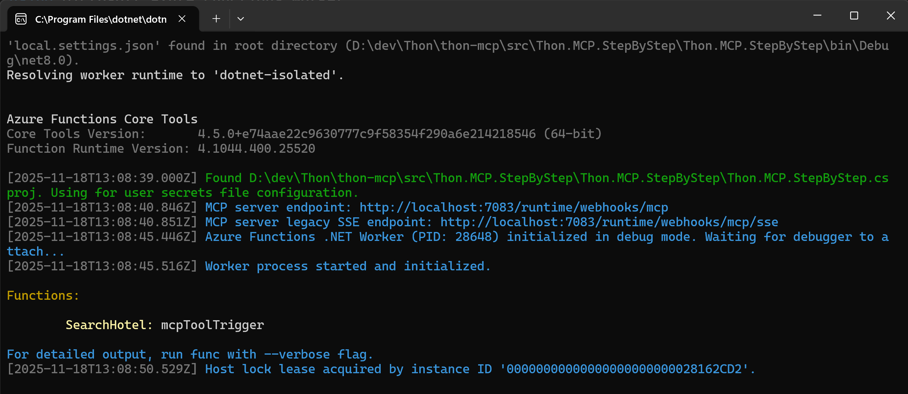
        
        
8. Test the MCP server locally (option 1)

    * Use MCP Inspector
        - Go to and follow the instructions for installation: 
        https://modelcontextprotocol.io/docs/tools/inspector
    * Configure you MCP:

        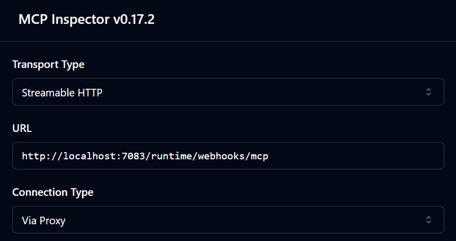

    * Test the tool:

        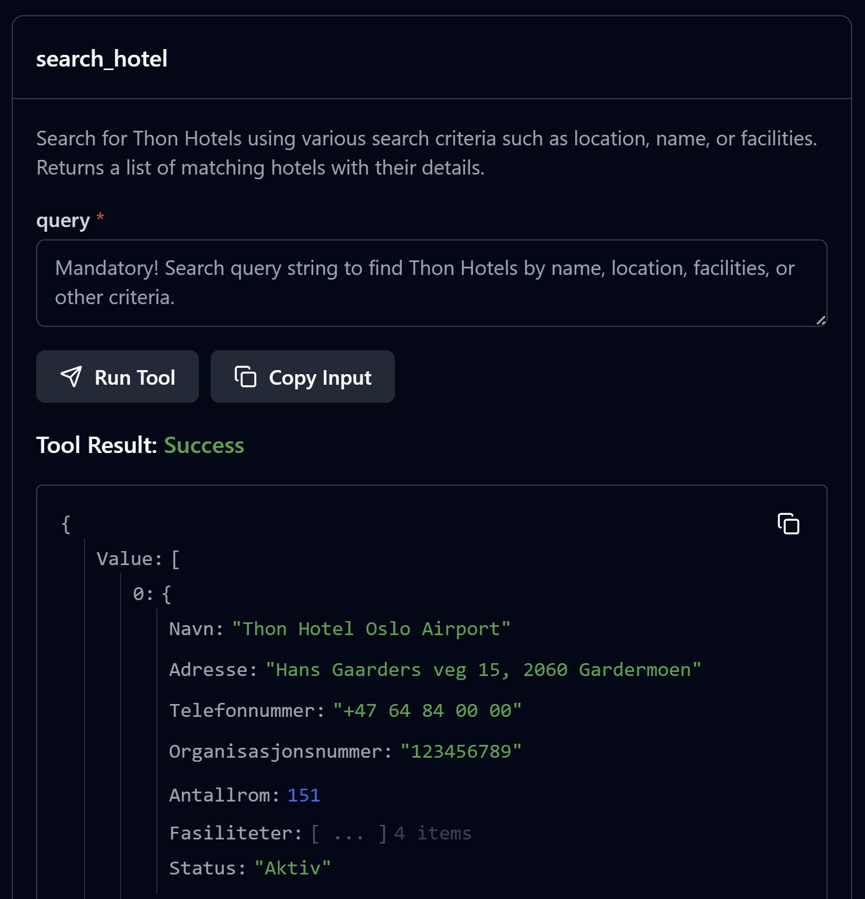

8. Test the MCP server locally (option 2, more fun)


    * Requires Github Copilot or similar
    * Open a empty folder in VSCode 
    * Add a .vscode folder
    * Add a mcp.json file to the folder
    * Add this content:    

        ```json
        {
            "servers": {
                "thon-mcp":{
                    "type": "http",
                    "url": "http://localhost:7083/runtime/webhooks/mcp",
                }
            }
        }     
        ``` 
    * Start the MCP-server

        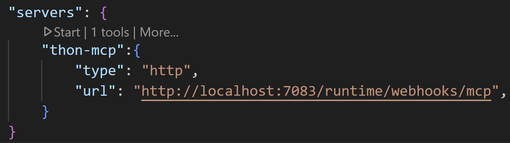

    * Make sure Github Copilot is in Agent mode

        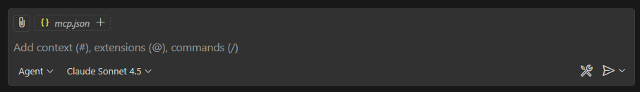

    * Ask about hotels with "treningssenter" in Oslo

        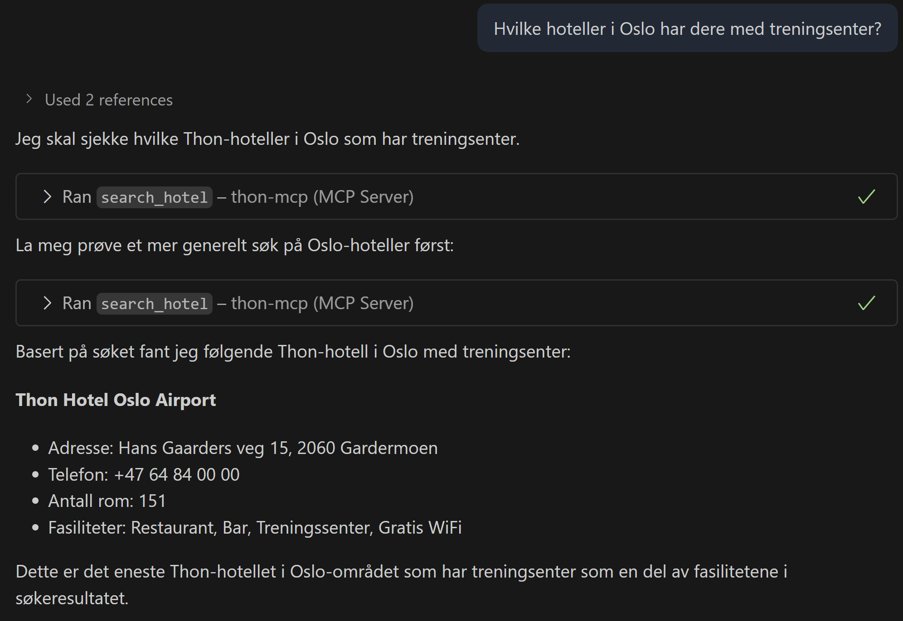

9. Create Azure Function App

    * Go to the Azure Portal
    * Create a new Azure Function App
        - Make sure to run on Windows
            - Chosing Flex Consumption will default to Linux, so choose the older Consumption model:
            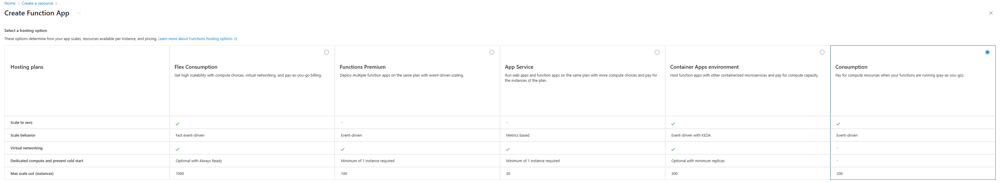
        - Use proper naming and use .NET 8 Isolated 

            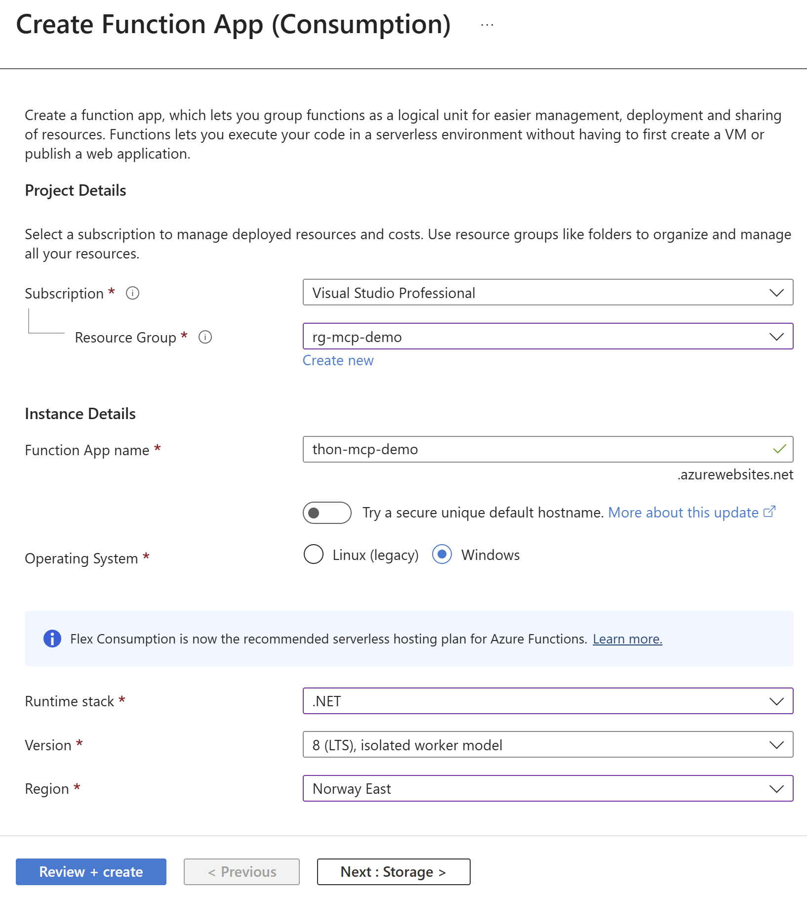
    * Click "Get publish profile" and download the profile in the newly created Azure Function App

10. Publish to Azure Function App
    * In Visual Studio, right-click solution and click Publish...
    * Select Import profile and select the profile you downloaded
    * Click Publish

12. Test the Remote MCP Server

    * Same as for local testing
    * Change to remote url
    * Get the "API Key" (mcp_extention) from the Azure Function App:

        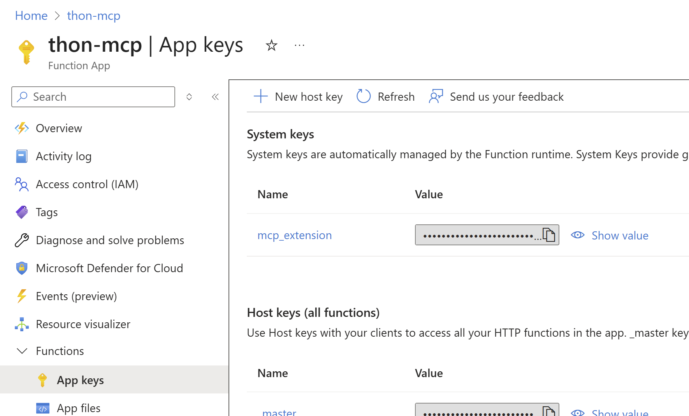

    * Add the key as a Header named "x-functions-key" in MCP Inspector

        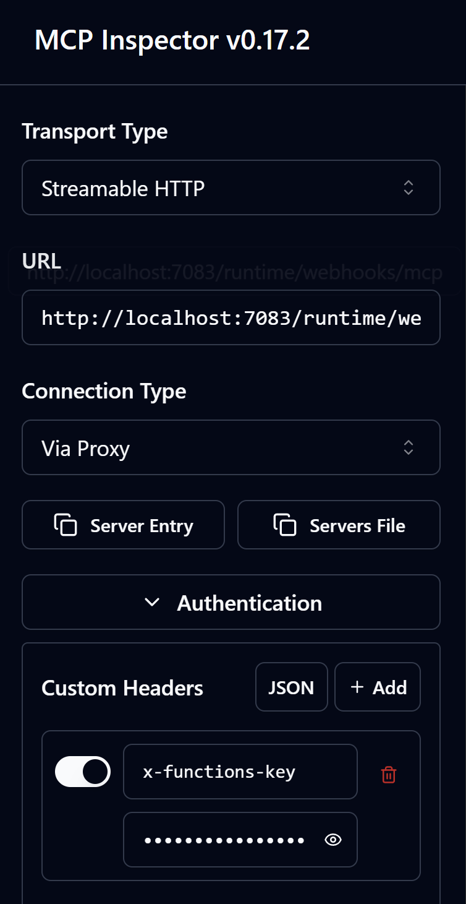

    * Or in mcp.json in VSCode:

        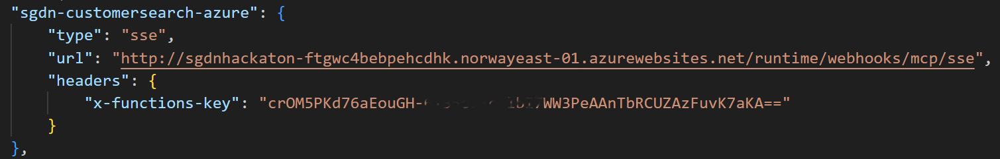

15. Create a Agent in Copilot Studio:

    * Go to https://copilotstudio.microsoft.com/
    * Click "New" -> "New Agent"
    * Give the Agent a descriptive name
    * Click "Create"
    * Go to "Tools" -> "Add a Tool"
    * Click "Create new tool"
    * Select "Model Context Protocol"
    * Add correct configuration

        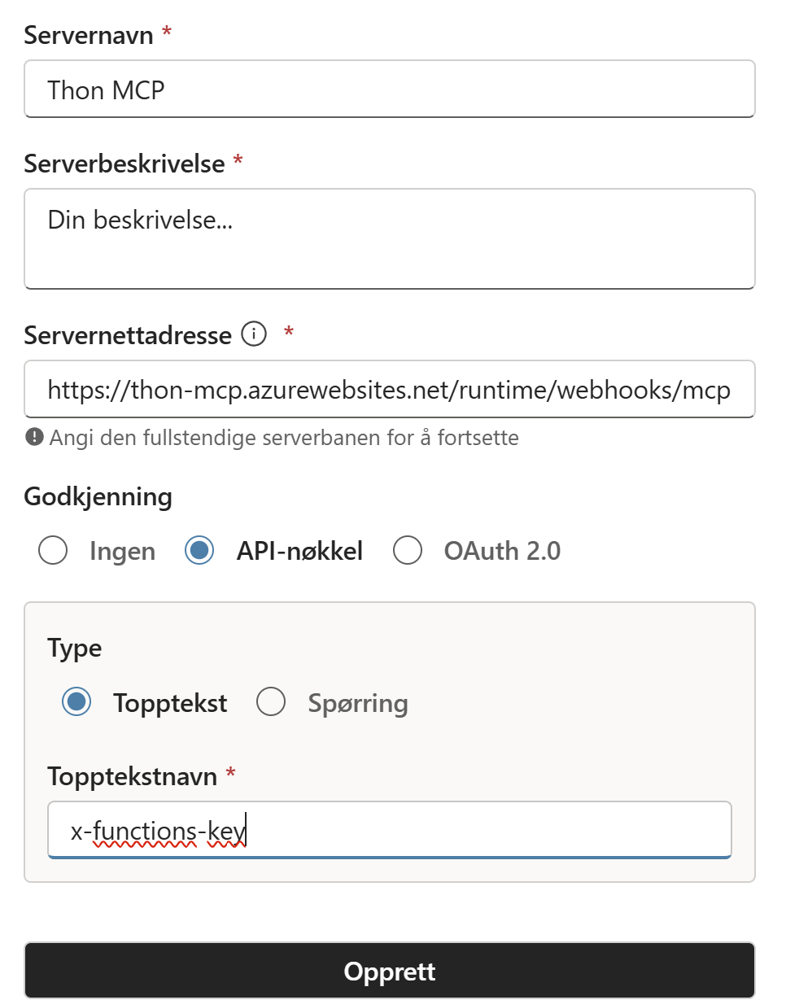

        - The server url must be without "sse" in the end, eg. <your server>/runtime/webhooks/mcp
        - Add API Key (header) named "x-functions-key"
        - Click "Create"
    * Click "Connect" - "Create connection"

        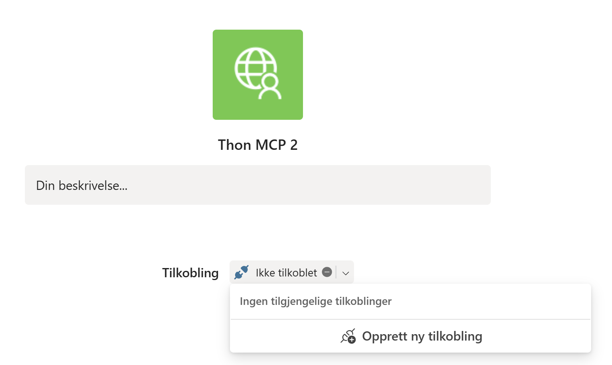
        - Add the key (App Keys -> mcp_extention) from the Azure Function App
    * Make sure the connection is ok
    * Click "Add to Agent"

16. Test the Agent in the Chat window in Copilot Studio

   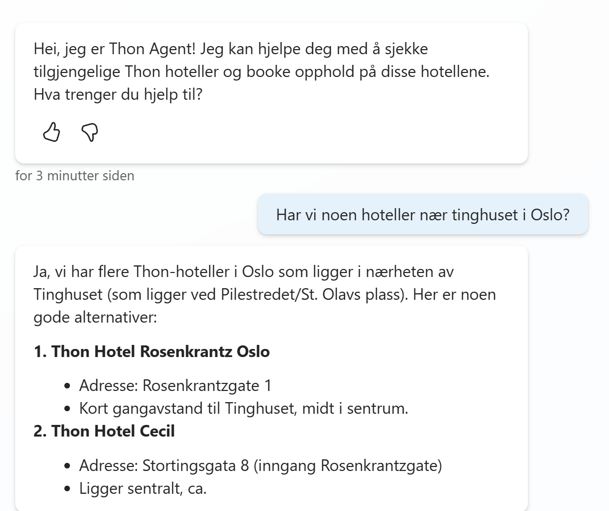


17. Add Agent to Teams or M365 Copilot

    * In Copilot Studio, go to Channels
    * Select Teams & Microsoft 365 Copilot
    * Click "Add to channel"
    * Allow "Publish"
    * Select "See Agent in Teams" or "MS 365"
    * Click "Add agent"
    * Test the agent by asking about "Drammen Autoco"

14. Congratulations! You've made a Agent using MCP Server!

    * Now, extend you MCP-server/code to use Thon-services to solve the case